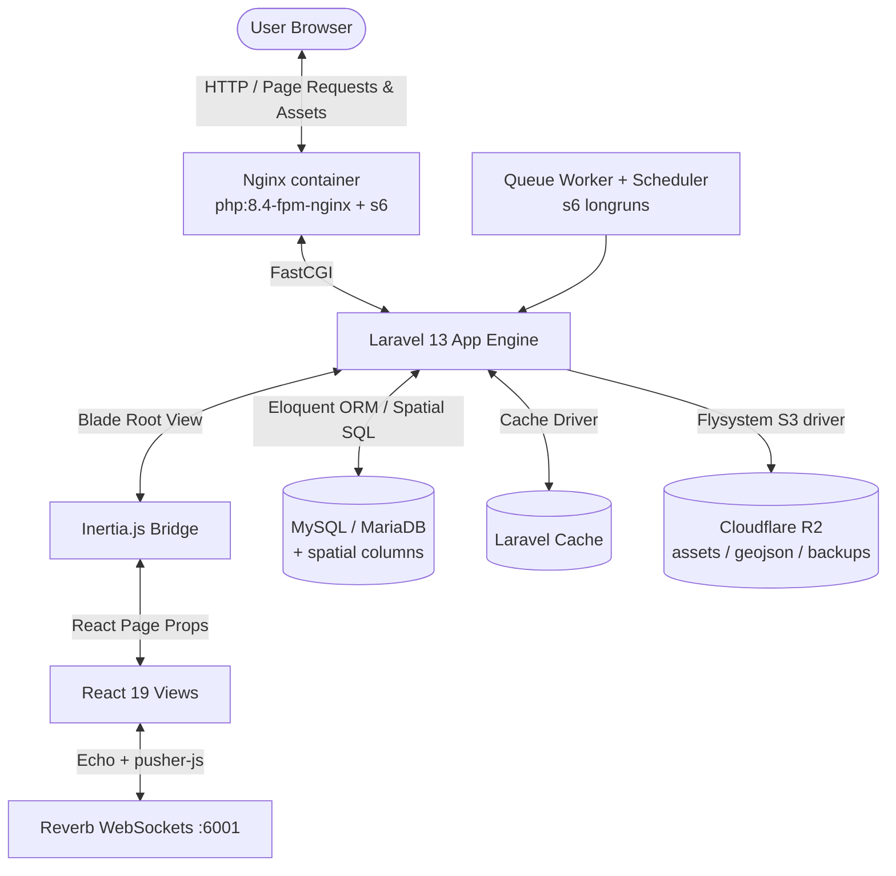

# Syrian Zone: High-Level System Map

High-level navigation map for the **Syrian Zone** codebase: a unified, same-origin **Laravel + Inertia.js + React (TypeScript)** monolith. Cookie-based session auth (Google OAuth), no separate backend/frontend workspaces.

---

## 1. System Architecture Overview



### Technology Stack (current)

| Layer | Technology |
|---|---|
| Backend | Laravel 13, PHP 8.3+ (runtime image PHP 8.4), Eloquent ORM |
| Admin panels | Filament v5 (`/admin` superadmin panel) + custom Inertia admin pages per module |
| Frontend bridge | Inertia.js v3 (Laravel ↔ React page props), SSR enabled (`ssr.tsx`) |
| View layer | React 19.2, TypeScript (strict), Tailwind CSS v4, shadcn-style components (Radix + CVA), Lucide icons |
| State/data | Zustand for map/studio stores; TanStack react-query (staleTime 5 min) for API data; custom axios client in `resources/js/Lib` |
| Mapping | MapLibre GL JS (+ `@mapbox/mapbox-gl-rtl-text`) and Leaflet/react-leaflet |
| Realtime | Laravel Reverb (websockets) — Guess Who signaling, echo client in `resources/js/echo.js` |
| Database | MySQL/MariaDB with spatial geometry columns (production); sqlite in tests (no spatial) |
| Search | Laravel Scout, `collection` driver by default (`SCOUT_DRIVER`) |
| Storage | Cloudflare R2 via Flysystem S3 driver (media, transit geojson, tierlist assets, spatie backups) |
| Auth | Google OAuth via Socialite; Sanctum tokens; role middleware aliases |
| Monitoring | Sentry (Laravel + @sentry/react, CI sourcemap upload), Prometheus `/api/metrics` |
| Backups | spatie/laravel-backup every 6h → local + R2 |
| Bundler | Vite 8 (`laravel-vite-plugin`, SSR build, Bun in Docker stage 1) |

---

## 2. Directory Tree Map

```
syrianzone/
├── app/
│   ├── Console/                 # Scheduled jobs & artisan commands (R2 migrations, HalaSyria sync…)
│   ├── Events/                  # Broadcast events (Guess Who signaling)
│   ├── Filament/Resources/      # Filament v5 resources: Users, GuessWho categories/characters
│   ├── Http/Controllers/        # One controller (or group) per feature module
│   │   └── Api/                 # JSON API controllers (V1/ TransitController, VotingDataController, …)
│   ├── Models/                  # Eloquent models incl. spatial definitions
│   ├── Providers/               # AppServiceProvider (rate limiters, gates), Filament panel provider
│   └── Services/                # Isolated business logic (PlaceImageService, HalaSyriaService, WeatherService…)
├── bootstrap/app.php            # Middleware config, role aliases, CSRF exceptions, AutoLoginDevUser
├── config/                      # Standard Laravel config + reverb/scout/sentry/backup/inertia
├── database/migrations/         # Schema per module (see reference/database-schema.md)
├── docker/                      # s6-overlay longruns: queue-worker, scheduler, reverb-server; nginx conf
├── docs/                        # This documentation tree
├── public/                      # Static files, flag-replacer extension, .well-known assetlinks
├── resources/
│   ├── css/                     # Tailwind v4 entry (@theme tokens, themes, fonts)
│   ├── js/
│   │   ├── Components/          # Shared UI: ui/ (shadcn), admin/, poll/, charts/, map/, Icons/
│   │   ├── Contexts/            # AuthContext
│   │   ├── Layouts/MainLayout.tsx
│   │   ├── Lib/                 # axios client, cn(), theme/font utils, geo-utils, exportImage…
│   │   ├── Pages/               # One folder per route/module (Inertia pages)
│   │   └── app.tsx / ssr.tsx    # Client + SSR entry points
│   └── views/app.blade.php      # Inertia root view
├── routes/                      # web.php, api.php, channels.php, console.php
├── scripts/                     # build-map-glyphs.mjs (fontnik), optimize_geojson_floats.py…
├── tests/                       # Pest (~21 Feature + Unit suites)
├── Dockerfile                   # Multi-stage: bun build → serversideup php:8.4-fpm-nginx + s6
└── android/                     # Bubblewrap TWA wrapper for the PWA (see platform/android-twa.md)
```

---

## 3. Request Flows

### Inertia page load
Browser → Nginx → Laravel controller → returns `Inertia::render('Page/Name', props)` → React 19 page component hydrates. Subsequent navigation is XHR-based SPA navigation.

### API data flow
React pages fetch JSON from `/api/*` using the shared axios client (`Lib/axios.ts`) wrapped in react-query (offlineFirst). Rate limits defined in `AppServiceProvider`: `voting` 10/min, `public-api` 60/min per IP.

### Spatial query flow (transit/places)
Controllers issue raw spatial SQL (`ST_AsGeoJSON`, `ST_Distance_Sphere`) against MySQL/MariaDB geometry columns; results cached (e.g. city geojson 1h) and large static datasets served from R2 CDN.

---

## 4. Module Index

| Module | Routes | Controllers | Pages (`resources/js/Pages/`) | Doc |
|---|---|---|---|---|
| Home portal | `/` | HomeController | Home.tsx | — |
| Polls / Tier list | `/polls/*`, `/tierlist*`, `/api/v1/polls*` | PollController, CandidateController, CandidateGroupController, Api\V1\VotingDataController | Polls/, TierList/ | [modules/polls-public-api.md](../modules/polls-public-api.md) |
| Transit | `/transit*`, `/api/v1/cities…`, `/studio/routes` | TransitAdminController, TransitStudioController, Api\V1\TransitController | Transit/ | [modules/transit.md](../modules/transit.md) |
| Mishwar (hidden places) | `/mishwar`, `/api/v1/places…`, `/my/places…` | Place*, PlaceDiscovery, PlaceEngagement controllers | Places/ | [modules/mishwar-places.md](../modules/mishwar-places.md) |
| Board ("لوحتي") | `/board`, `/api/v1/board` | BoardController | Board/ (14 widgets) | [modules/board.md](../modules/board.md) |
| Guess Who | `/guesswho*`, signaling + broadcasting auth | GuessWhoController, SignalingController | GuessWho/ | [modules/guess-who.md](../modules/guess-who.md) |
| Officials directory | `/syofficial`, `/api/v1/admin/syofficial/*` | SyOfficial*, SyOfficialAdminController | SyOfficial/ | [modules/directories.md](../modules/directories.md) |
| Phonebook | `/phonebook`, `/api/v1/admin/phonebook/*` | Phonebook*, PhonebookAdminController | Phonebook/ | [modules/directories.md](../modules/directories.md) |
| Gov apps | `/govapps`, `/api/v1/admin/govapps` | GovAppController, GovAppsAdminController | GovApps/ | [modules/directories.md](../modules/directories.md) |
| Hotels (HalaSyria) | `/api/v1/hotels*` | HotelController, HalaSyriaService | Places/ hotel layer | [modules/directories.md](../modules/directories.md) |
| Population atlas | `/population`, `/population/master`, `/env-report` | Api\PopulationAtlasController | Population/ | [modules/population-atlas.md](../modules/population-atlas.md) |
| Widgets APIs | `/weather`, `/answers`, `/recipe-of-the-day`, `/events/today`, `/feed`, `/prayer-times` | Weather/Answers/Recipe/Events/Feed/Prayer controllers | Board widgets consume these | [modules/board.md](../modules/board.md) |
| External data | `/syid`, `/sites`, `/party`, `/house`, `/alignment`, `/syrian-contributors` | ExternalDataController, ContributorController | SyId/, Sites/, Party/, House/, Alignment/, SyrianContributors/ | — |
| Quizzes | `/compass`, `/priorities` | (Inertia closures) | Compass/, Priorities/ | — |
| Standalone pages | `/roznama`, `/shawarma`, `/justice`, `/crossings`, `/about`, `/stats` | (Inertia closures) | Roznama/, Shawarma/, Justice/, Crossings/, About/, Stats/ | — |
| Dashboard/auth | `/dashboard`, `/auth/google*`, `/user` | AuthController, DashboardController, AdminUserController | Dashboard/ | — |
| Assets admin | `/admin/assets`, `/api/v1/admin/assets/*` | AssetUploadController | Admin/AssetManager | [reference/asset-storage.md](../reference/asset-storage.md) |
| Meta | `/sitemap.xml`, `/healthcheck`, `/api/metrics`, `/api/app-icon` | Sitemap/Metrics controllers | — | — |

Full route details: [reference/routes-api-map.md](../reference/routes-api-map.md).

---

## 5. Roles & Access Control

Middleware aliases registered in `bootstrap/app.php`: `admin`, `transit_admin`, `syofficial_admin`, `phonebook_admin`, `superadmin`. Users carry a `role` enum, optional JSON `permissions`, soft-delete/ban fields. `Gate::before` gives superadmins everything. Dev-only role impersonation at `/dev/impersonate/{role}` (DevRoleSwitcher component).

---

## 6. Deployment

Single Docker image built by GitHub Actions on push to `main`, pushed to ghcr.io, then deployed over SSH via `/opt/syrianzone/deploy.sh <sha>` with health gating. Exposes ports 8080 (HTTP) and 6001 (Reverb). See [getting-started/deployment.md](../getting-started/deployment.md) and staging notes in [getting-started/staging.md](../getting-started/staging.md).

---

## 7. External Service Integrations

| Integration | Used by |
|---|---|
| Google OAuth | Login (`/auth/google`) |
| Cloudflare R2 | Media disk, transit geojson, tierlist assets, brand kit downloads, spatie backups |
| Open-Meteo (forecast + archive), OpenWeatherMap fallback | Weather widget / climate atlas |
| Aladhan API | Prayer times |
| Google Sheets published CSVs | SyID, house data, alignment quiz |
| Supabase REST | Some external datasets |
| Railway-hosted GraphQL events backend | Events today widget |
| RSS feeds (SANA, Halab Today, Jard Chat, Syrian Observer) | News feed widget |
| HalaSyria (`halasyria.com`) | Hotels sync every 2 days |
| Google Places API | Place geocode/discovery in Mishwar |
| iTunes Lookup + Play Store scraping | `/api/app-icon` icons |
| Sentry, Prometheus | Error tracking & metrics |
