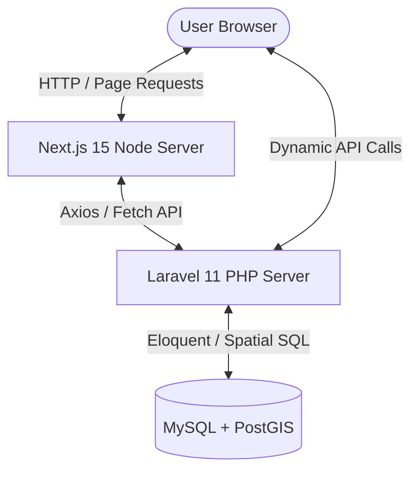
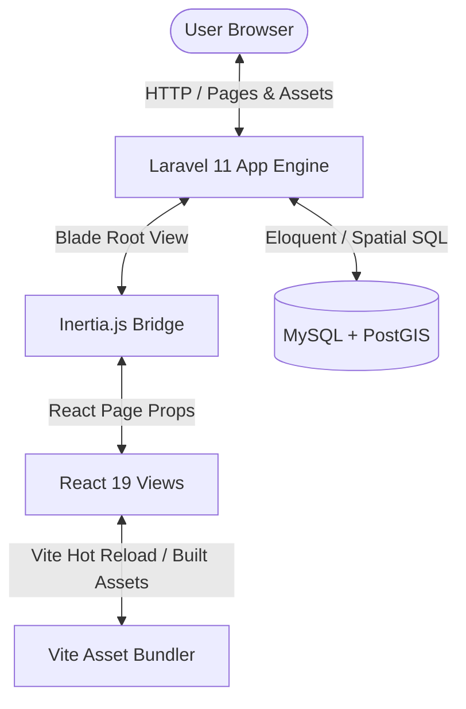

# Syrian Zone: Laravel + InertiaJS Consolidation & Migration Plan

This document provides a highly detailed, professional engineering blueprint to migrate the **Syrian Zone** application from a decoupled architecture (Next.js 15 frontend and Laravel 11 API backend) into a single, consolidated **Laravel + Inertia.js + React (TypeScript)** codebase.

---

## 1. Architectural Feasibility & Trade-Off Analysis

### A. Is This a Good Idea?
**Yes.** Consolidating the decoupled Next.js + Laravel structure into a unified Laravel + InertiaJS architecture is highly beneficial. It resolves several critical architectural and security issues identified in the [Architecture Critique](file:///run/media/hadi/SSD2/Coding/syrianzone/docs/architecture_critique.md).

#### Advantages of Consolidation
1.  **Elimination of CORS & Preflight Requests**: Currently, every frontend interaction triggers cross-origin routing, requiring custom headers and preflight checks (`cors.php`). A unified codebase operates entirely under a single domain, eliminating configuration mismatches and reducing network latency.
2.  **Simplified Data Hydration (No API Duplication)**: In the Next.js setup, you must declare routes, build Laravel JSON controllers, fetch the endpoints in Next.js, model the JSON types, and handle caching via TanStack Query. With Inertia, the Laravel Controller queries the database and passes data directly as React props. This cuts source code complexity in half.
3.  **Consolidated, Stateful Session Authentication**: Inertia works natively with Laravel's built-in session-based authentication. This instantly solves the security issues of permanent SHA-256 tokens in `localStorage`. Admin routes are protected using standard web guards and secure HTTP-only cookies, preventing XSS extraction attacks.
4.  **Single Deployment Pipeline**: Deployment is simplified. Instead of managing two separate runtime servers (Next.js via PM2 and Laravel via PHP-FPM) and coordinating their environments, you deploy a single Laravel application. Vite compiles frontend assets directly into Laravel's `public/build` directory.
5.  **Reduced Overhead**: Eliminates the Node.js production server overhead for regular page routing. A single PHP process manages the application lifecycle, using local server memory efficiently.

#### Potential Trade-offs to Consider
*   **Initial Refactoring Effort**: You must rewrite the routing layer, adapt Next.js-specific imports (e.g., `next/link`, `next/navigation`, `next/image`), and restructure the root HTML layout.
*   **SEO Setup**: Next.js handles Static Site Generation (SSG) and Incremental Static Regeneration (ISR) out-of-the-box. Inertia supports SEO natively but requires setting up **Inertia Server-Side Rendering (SSR)** (a background Node process running a compiled JS bundle) to serve fully populated HTML to search engine bots.

---

### B. Is It Possible?
**Yes.** Inertia.js officially supports React and TypeScript. Since the frontend is already written in React (using standard TSX components, Tailwind CSS, Lucide icons, and state stores like Zustand), the vast majority of your visual components and interactive logic will copy over directly with only import and routing modifications.

---

### C. How Complex Is It?
*   **Overall Complexity**: **Medium-High**
*   **High Complexity Elements**:
    *   **Geospatial & Interactive Map Modules**: The MapLibre GL instance in the Transit and Population Atlas modules relies heavily on client-side rendering (CSR), custom canvas overlays, and Mapbox Draw. These will continue to run as client-side components but require careful integration with Laravel's asset compilation.
    *   **Authenticating Third-Party OAuth (Google Socialite)**: The transition from Sanctum stateless tokens back to stateful web sessions needs to be coordinated in both the auth controllers and Google OAuth callback redirect paths.
    *   **PWA / Service Worker Offline Caching**: Transitioning from Next-specific PWA configurations (`@serwist/next`) to a standard Vite PWA compiler configuration.

---

## 2. System Architecture Comparison

### A. Current Decoupled Architecture


### B. Consolidated InertiaJS Architecture


---

## 3. Directory Re-Structuring & File Mapping

To consolidate the workspaces, all files inside `/backend` will move to the root of the repository. The `/frontend` directory will be retired, and its assets and source code will be integrated into the Laravel structure.

### Consolidated Repository Layout
```
syrianzone/                          # Root Directory (formerly backend/)
├── app/                             # Laravel Controllers, Models, and Middleware
├── bootstrap/                       # Laravel Application Bootstrap
├── config/                          # Laravel Configuration
├── database/                        # Migrations, Seeders, and Dumps
├── docs/                            # Architecture Maps & Plans
├── public/                          # Publicly accessible assets
│   ├── assets/                      # Brand images, flags, download items
│   └── styles/                      # Map styles (dark-matter.json) & local vector grids
├── resources/                       # Frontend Source & Assets
│   ├── css/
│   │   └── app.css                  # Merged Tailwind & global CSS
│   ├── js/
│   │   ├── app.tsx                  # Inertia React entrypoint
│   │   ├── Components/              # Shared components (Shadcn declarations)
│   │   ├── Contexts/                # Global Theme/Language providers
│   │   ├── Layouts/                 # Persistent Layout wrappers (Navbar, Sidebar)
│   │   ├── Lib/                     # Client utils (API client, coordinate helpers)
│   │   ├── Pages/                   # Inertia Page Components (migrated from app Router)
│   │   └── Types/                   # Shared TypeScript declarations
│   └── views/
│       └── app.blade.php            # HTML entry point for Inertia
├── routes/                          # Web and API routing mappings
│   ├── web.php                      # Handles ALL Inertia and Auth routes
│   └── api.php                      # Handles dynamic spatial/search endpoints
├── package.json                     # Merged node package dependencies
├── tsconfig.json                    # Consolidated TypeScript rules
├── tailwind.config.js               # Unified Tailwind styling rules
└── vite.config.js                   # Vite config with Laravel + React plugins
```

### Direct Folder & Component Mapping

| Original Next.js Path (`/frontend/...`) | Target Consolidated Path (`/resources/...` or `/public/...`) | Actions Required |
| :--- | :--- | :--- |
| `public/assets/` | `public/assets/` | Copy directly to public. |
| `public/styles/` | `public/styles/` | Copy map styles and geo-references. |
| `src/app/globals.css` | `resources/css/app.css` | Merge Tailwind imports and custom variables. |
| `src/components/ui/` | `resources/js/Components/ui/` | Copy Shadcn UI parts; fix import references. |
| `src/context/` | `resources/js/Contexts/` | Copy Theme and Language contexts. |
| `src/app/_components/` | `resources/js/Layouts/` | Move shared headers, footers, and overlays. |
| `src/lib/` | `resources/js/Lib/` | Move API client and global helpers. |
| `src/app/page.tsx` & `HomeClient.tsx` | `resources/js/Pages/Home.tsx` | Convert to standard Inertia React component. |
| `src/app/transit/page.tsx` | `resources/js/Pages/Transit/Index.tsx` | Map to route `/transit`. |
| `src/app/transit/city/[id]/page.tsx` | `resources/js/Pages/Transit/CityMap.tsx`| Map to route `/transit/city/{id}`. |
| `src/app/transit/studio/page.tsx` | `resources/js/Pages/Transit/Studio.tsx` | Map to route `/transit/studio`. |
| `src/app/transit/admin/page.tsx` | `resources/js/Pages/Transit/Admin.tsx` | Map to route `/transit/admin`. |
| `src/app/polls/page.tsx` | `resources/js/Pages/Polls/Index.tsx` | Map to route `/polls`. |
| `src/app/polls/[slug]/page.tsx` | `resources/js/Pages/Polls/Show.tsx` | Map to route `/polls/{slug}`. |
| `src/app/compass/page.tsx` | `resources/js/Pages/Compass/Index.tsx` | Map to route `/compass`. |
| `src/app/tierlist/page.tsx` | `resources/js/Pages/TierList/Index.tsx` | Map to route `/tierlist`. |
| `src/app/population/page.tsx` | `resources/js/Pages/Population/Index.tsx`| Map to route `/population`. |
| `src/app/syofficial/page.tsx` | `resources/js/Pages/SyOfficial/Index.tsx`| Map to route `/syofficial`. |
| `src/app/govapps/page.tsx` | `resources/js/Pages/GovApps/Index.tsx` | Map to route `/govapps`. |
| `src/app/syid/page.tsx` | `resources/js/Pages/SyId/Index.tsx` | Map to route `/syid`. |

---

## 4. Technical Transition Blueprints

### A. Routing & Page Data Handling
Next.js Server Components that fetch data at build/request time map to standard Laravel Controllers returning `Inertia::render()`.

#### Next.js Original Code (Decoupled Fetch)
```tsx
// frontend/src/app/polls/page.tsx (Next.js SSR Component)
export default async function PollsPage() {
  const res = await fetch(`${process.env.NEXT_PUBLIC_API_URL}/api/polls`, { cache: 'no-store' });
  const polls = await res.json();
  return <PollsClient initialPolls={polls} />;
}
```

#### Consolidated InertiaJS Equivalent
```php
// app/Http/Controllers/PollController.php (Laravel Controller)
use Inertia\Inertia;

public function index()
{
    $polls = Poll::with('candidateGroups.candidates')->latest()->get();
    
    return Inertia::render('Polls/Index', [
        'initialPolls' => $polls
    ]);
}
```
```tsx
// resources/js/Pages/Polls/Index.tsx (React Component)
import React from 'react';
import Layout from '@/Layouts/MainLayout';

interface PollsProps {
  initialPolls: any[];
}

export default function Index({ initialPolls }: PollsProps) {
  return (
    <Layout>
      <div className="polls-container">
        {initialPolls.map(poll => (
          <PollCard key={poll.id} poll={poll} />
        ))}
      </div>
    </Layout>
  );
}
```

---

### B. State Management & API Fetching
*   **Persistent Client State**: Zustand stores (`useMapStore.ts`, `useStudioStore.ts`) handle highly reactive, local-only client actions. They remain 100% intact.
*   **Dynamic API Queries**: Async processes like stops/nearby lookups, real-time map spatial queries, and live search results do not need to trigger full Inertia page updates. They remain standard Laravel API routes returning pure JSON, queried asynchronously from React using simple `fetch` or a local client:
    ```typescript
    // resources/js/Lib/apiClient.ts
    import axios from 'axios';
    
    export const apiClient = axios.create({
      baseURL: '/', // Same-origin request
      headers: {
        'Content-Type': 'application/json',
      }
    });
    ```

---

### C. Session Authentication Consolidation
Consolidating to Inertia allows replacing Sanctum stateless API tokens with standard Laravel session cookies.

1.  **Unified Auth Controllers**: Use Laravel's web guard middleware:
    ```php
    // routes/web.php
    Route::post('/admin/login', [AuthController::class, 'webLogin']);
    Route::post('/logout', [AuthController::class, 'webLogout']);
    
    Route::middleware(['auth', 'role:transit-admin'])->group(function () {
        Route::get('/transit/admin', [TransitAdminController::class, 'renderAdminPanel']);
        Route::post('/transit/admin/drafts/{id}/approve', [TransitAdminController::class, 'approve']);
        Route::post('/transit/admin/drafts/{id}/reject', [TransitAdminController::class, 'reject']);
    });
    ```
2.  **Eliminating Storage Leaks**: Since credentials live in secure HttpOnly session cookies, the front-end no longer stores authorization tokens in `localStorage`. This closes the XSS attack surface completely.

---

### D. CSS Modules & Styling Integration
The [Architecture Critique](file:///run/media/hadi/SSD2/Coding/syrianzone/docs/architecture_critique.md) highlighted massive CSS template literals in `TransitStudioPage` and `TransitAdminPage` (>400 lines). In the unified Inertia codebase, these should be separated into standard CSS stylesheets in `resources/css/modules/` or handled directly using Tailwind utility classes.

Vite will bundle these clean CSS imports efficiently:
```typescript
// vite.config.js
import { defineConfig } from 'vite';
import laravel from 'laravel-vite-plugin';
import react from '@vitejs/plugin-react';

export default defineConfig({
    plugins: [
        laravel({
            input: ['resources/css/app.css', 'resources/js/app.tsx'],
            refresh: true,
        }),
        react(),
    ],
    resolve: {
        alias: {
            '@': '/resources/js',
        },
    },
});
```

---

## 5. Step-by-Step Migration Roadmap

```
+------------------------------------+
|  Phase 1: Environment & Setup       | -> Set up Laravel Inertia packages, config, Vite plugin.
+------------------------------------+
                  |
                  v
+------------------------------------+
|  Phase 2: Global Shell & Layout    | -> Migrate root Blade, globals CSS, Theme/Lang Providers.
+------------------------------------+
                  |
                  v
+------------------------------------+
|  Phase 3: Core Module Migration    | -> Migrate pages (Home, Polls, Compass, Atlas, Transit).
+------------------------------------+
                  |
                  v
+------------------------------------+
|  Phase 4: Auth & Uploads Security  | -> Migrate Web OAuth session auth, secure storage disks.
+------------------------------------+
                  |
                  v
+------------------------------------+
|  Phase 5: Performance & PWA Tuning | -> Configure PWA worker, setup SSR caching, deploy updates.
+------------------------------------+
```

### Phase 1: Environment Setup & Packages
1.  **Configure Root Working Directory**: Move all directories and configuration files inside `backend/` up into the main repository root. Delete/archive the empty `backend/` folder.
2.  **Install Composer Dependencies**:
    ```bash
    composer require inertiajs/inertia-laravel
    ```
3.  **Install NPM Dependencies**: Merge package configurations from `frontend/package.json` into the root `package.json` and install:
    ```bash
    npm install @inertiajs/react @vitejs/plugin-react react react-dom @types/react @types/react-dom typescript @types/node
    ```
4.  **Create Inertia Root View**: Create `resources/views/app.blade.php`.
5.  **Initialize Inertia Middleware**:
    ```bash
    php artisan inertia:middleware
    ```
    Register `HandleInertiaRequests` middleware inside `bootstrap/app.php`.
6.  **Configure Vite**: Update `vite.config.js` to include the React plugin and handle JSX/TSX resolution.

### Phase 2: Global Layouts & Providers
1.  **Initialize React Entry Point**: Create `resources/js/app.tsx`.
2.  **Styles Merge**: Copy the styling declarations from `frontend/src/app/globals.css` into `resources/css/app.css`. Fix fonts and background assets.
3.  **Global Contexts**: Relocate `frontend/src/context/` into `resources/js/Contexts/`.
4.  **Core Layouts**: Move the core header, footer, and navigation menus to `resources/js/Layouts/`.

### Phase 3: Page Migrations
1.  **Static Pages**: Migrate `HomeClient.tsx`, `govapps`, `syid` into `resources/js/Pages/` as standard page components. Set up simple Laravel web routes returning them via Inertia.
2.  **Opinion & Leaderboards Module**: Migrate `polls` and `tierlist` pages. Connect database models inside `PollController` and return variables directly as props.
3.  **Spatial Atlas Module**: Migrate the Leaflet maps and data loaders in the `population` module.
4.  **Transit Core Module**: Relocate transit components, types, hooks, and Zustand state configurations. Map `/transit` to `TransitController` and route parameters dynamically.

### Phase 4: Authentication & File Uploads Refactoring
1.  **Session Database Migration**: Set up standard sessions table in the database to support stateful logins.
2.  **Sanctum removal**: Transition API routes to Web routes, protecting admin endpoints with standard session middleware.
3.  **File Uploads**: Relocate images and upload handlers from the Next.js API endpoints to Laravel's controller endpoints using native file validation and storage disks.

### Phase 5: Verification, SEO, and Deployment
1.  **Verify Asset Compiling**: Run `npm run build` to verify standard Vite bundles, ensuring chunk optimizations.
2.  **Service Worker Integrations**: Re-register PWA rules under standard service workers in Vite PWA.
3.  **Configure Deployment Runner**: Update `deploy.sh` and `ecosystem.config.js` to build and serve the unified Laravel runtime environment, eliminating Next.js build steps.

---

## 6. Master Task List

- [x] **Phase 1: Base Setup**
  - [x] Move `/backend` files to repository root.
  - [x] Add `inertiajs/inertia-laravel` in composer requirements.
  - [x] Merge `frontend/package.json` packages into the root `package.json`.
  - [x] Run `npm install` and resolve compiler conflicts.
  - [x] Create `resources/views/app.blade.php`.
  - [x] Register `HandleInertiaRequests` middleware in `bootstrap/app.php`.
  - [x] Update `vite.config.js`.
  - [x] Configure `tsconfig.json` paths for resolution alias `@/*` pointing to `resources/js/*`.

- [x] **Phase 2: Global Layouts & Providers**
  - [x] Create `resources/js/app.tsx` entry point.
  - [x] Merge global CSS imports into `resources/css/app.css`.
  - [x] Move Theme and Language context files to `resources/js/Contexts/`.
  - [x] Migrate `Navbar` and `Footer` elements into `resources/js/Layouts/MainLayout.tsx`.

- [x] **Phase 3: Core Module Migrations**
  - [x] **Home Page**: Create `HomeController`, read and parse `about.md` on the server, render `Home.tsx`.
  - [x] **Verified Accounts**: Migrate `syofficial` pages, passing database sites as React props.
  - [x] **Opinion & Polling**: Update `PollController` routes to use Inertia, migrate `Polls/Index.tsx` and `Polls/Show.tsx`.
  - [x] **Political Compass**: Migrate compass question state logic, questions list, and rendering graphs.
  - [x] **Population Atlas**: Move environmental map aggregations and dynamic leaflet rendering.
  - [x] **Transit Module**:
    - [x] Copy components from `frontend/src/app/transit/_components` to `resources/js/Pages/Transit/Components`.
    - [x] Migrate `useMapStore` and `useStudioStore` Zustand declarations.
    - [x] Move MapLibre map initialization hooks.
    - [x] Rewrite map-data loading logic to query database geometries, returning coordinates as JSON directly.

- [x] **Phase 4: Auth & Security Consolidation**
  - [x] Remove Sanctum tokens from client login pipelines.
  - [x] Set up stateful, session-based user authentication using Web guard.
  - [x] Create `AdminMiddleware` checking roles on standard HTTP sessions.
  - [x] Eliminate `TransitAdminAuth` middleware using raw tokens in `.env`. Validate credentials in DB.
  - [x] Transition file upload targets to use Laravel storage structures.

- [x] **Phase 5: Deploy & Verification**
  - [x] Set up service worker caching policies.
  - [x] Test Vite output production bundles.
  - [x] Update `deploy.sh` to build assets under the unified workspace structure.
  - [x] Update `ecosystem.config.js` to run a single PHP-FPM / Artisan entry process.
