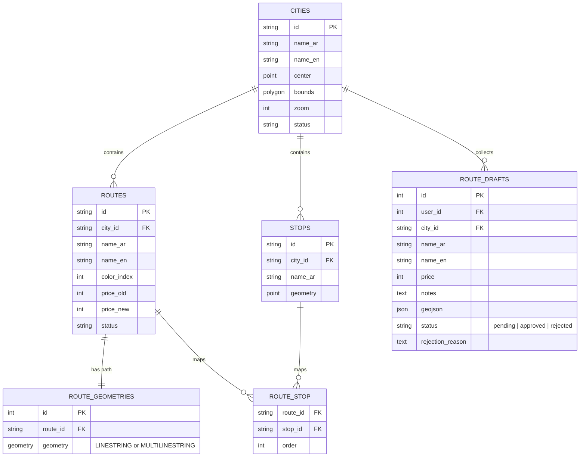
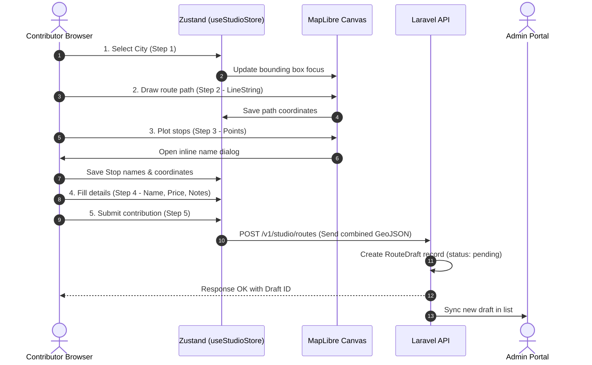
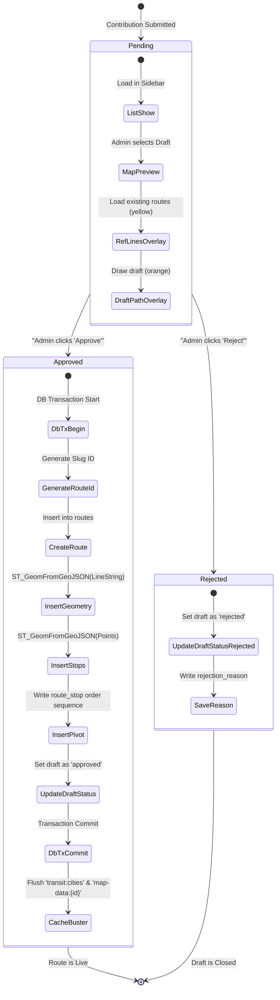

# Syrian Zone: Transit Module Deep Dive Map

This document maps out the architecture of the **Syrian Transit (ترانزيت)** module. It covers the geospatial database schema, geographical queries, client-side mapping layers, state management, and the lifecycle workflows of route creations and moderations.

---

## 1. Geospatial Database Schema & Models

The Transit backend uses MySQL/MariaDB with **Spatial (PostGIS-compatible) extensions** to store and query coordinates, geometries, and polygons.



### Database Tables Breakdown
1.  **`cities`**: Defines active operational boundaries.
    *   `center` (`POINT`): Map initial focal coordinates.
    *   `bounds` (`POLYGON`): Geofence limits.
2.  **`routes`**: Represents transit line metadata (Service paths).
3.  **`route_geometries`**: Segregated table storing geographic tracks.
    *   `geometry` (`GEOMETRY`): Stores coordinates for `LineString` or `MultiLineString` paths.
4.  **`stops`**: Points of passenger boarding.
    *   `geometry` (`POINT`): Geographic coordinate.
5.  **`route_stop`**: Pivot table mapping routes to stops.
    *   `order` (`INTEGER`): Visual traversal sequence of stops on the route.
6.  **`route_drafts`**: Stores community submissions from the **Transit Studio**.
    *   `geojson` (`JSON`): Complete client-designed map collection combining paths and points.

---

## 2. SQL & Spatial Operations

The backend performs advanced PostGIS spatial queries to handle search, geo-decoding, and distance lookups:

### A. Distance Calculation (Nearby Stops)
Finds all bus stops within $R$ meters (default: 500m) of the user's location coordinates.
*   **API**: `GET /v1/stops/nearby?lat=33.513&lng=36.291`
*   **SQL Logic** (`TransitController@getNearbyStops`):
    ```sql
    SELECT id, name_ar, city_id, ST_AsGeoJSON(geometry) as geojson 
    FROM stops 
    WHERE ST_Distance_Sphere(geometry, ST_GeomFromText('POINT(lng lat)')) <= radius
    ```

### B. GeoJSON Rendering (Map Data Load)
Instead of retrieving raw columns, Laravel converts database geometric fields into GeoJSON-compliant strings at query time.
*   **API**: `GET /v1/cities/{id}/map-data`
*   **SQL Logic** (`TransitController@getMapData`):
    ```sql
    -- Load route paths
    SELECT routes.*, ST_AsGeoJSON(route_geometries.geometry) as geojson
    FROM route_geometries
    INNER JOIN routes ON route_geometries.route_id = routes.id
    WHERE routes.city_id = ? AND routes.status = 'published';

    -- Load stop locations
    SELECT id, name_ar, ST_AsGeoJSON(geometry) as geojson
    FROM stops
    WHERE city_id = ?;
    ```

---

## 3. Client-Side Mapping & Layering (MapLibre GL)

The map canvas loads vector tiles using MapLibre GL and layers them in order of rendering priority.

```
+-------------------------------------------------------+
|  Top: NearbyTransitDrawer / GlobalSearchBox (UI overlays) |
+-------------------------------------------------------+
|  Layer 5: UserLocationLayer (Active GPS position)      |
+-------------------------------------------------------+
|  Layer 4: StopsLayer (Interactive red/blue stop dots) |
+-------------------------------------------------------+
|  Layer 3: RouteLayer (Active / Highlighted Route path) |
+-------------------------------------------------------+
|  Layer 2: Background reference lines (Opacity 0.22)   |
+-------------------------------------------------------+
|  Layer 1: MapLibre Base Vector (dark-matter style)    |
+-------------------------------------------------------+
```

### Style Scheme (`dark-matter.json`)
The application relies on a locally hosted dark-themed style sheet to ensure privacy and allow potential offline operations.

### Hover and Selection Store (`useMapStore.ts`)
Tracks the user's interactions with map entities:
*   `selectedRouteId` (string | null): The currently selected service line. Triggers focus fitting on that specific line.
*   `hoveredStopId` (string | null): Active stop marker highlighted.
*   `mapBounds` (`[[number, number], [number, number]]`): Dynamic map bounding coordinates.

---

## 4. Workflows

### A. Community Contribution Lifecycle (Transit Studio)



#### Detailed Studio States (`useStudioStore.ts`)
*   `WizardStep`: 1 (City Select) $\rightarrow$ 2 (Draw Line) $\rightarrow$ 3 (Add Stops) $\rightarrow$ 4 (Details) $\rightarrow$ 5 (Review).
*   `drawnLine`: `[longitude, latitude]` arrays.
*   `stops`: Objects consisting of `id: Date.now()`, coordinate array, and localized `nameAr`.

---

### B. Admin Moderation Lifecycle (Transit Admin)

The Admin section verifies community drafts and converts them into published database routes in a single database transaction.



#### Database Cache Busting
Upon approval or rejection, the backend explicitly busts associated cache keys to ensure instant map updates for the next user:
```php
Cache::forget("transit:map-data:{$draft->city_id}");
Cache::forget('transit:cities');
```
This forces the subsequent client calls to read the freshly populated geometries directly from the PostGIS database.
