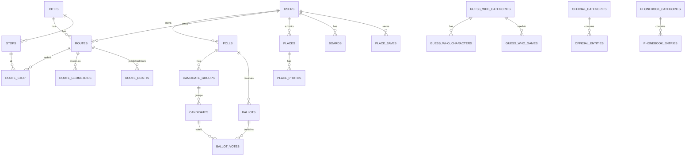

# Database Schema Chart

Derived from `database/migrations/`. All feature tables use UUID primary keys unless noted. Production DB is MySQL/MariaDB with spatial geometry columns; tests run on sqlite (spatial features unavailable — see board-spec caveats).

## Module ER overview

## Users & auth

**users** — name, email, google_id (OAuth), avatar, role enum, permissions JSON, settings JSON (2026_07_23), soft deletes + banned_at. Access tokens via Sanctum (`personal_access_tokens`).

## Contributors

- **contributors** — name, avatar_url, profile_url, total_contributions
- **contributions** — contributor_id FK, repository, type, url, description, date
- (`static_sites` was created then dropped — moved out of the repo)

## Polls / Tier list voting

All UUID PKs.

- **polls** — slug, title, timezone (default Europe/Amsterdam), is_active, user_id (nullable owner)
- **candidate_groups** — poll_id, name, key (`minister`, `governor`, …), sort_order, is_default
- **candidates** — poll-scoped via group; name, title, image_url, category default `minister`, sort, candidate_group_id, legacy_id, archive fields (archived_at), user_id
- **ballots** — poll_id, vote_day, voter_key (hashed identity), ip_hash, user_agent — never exposed by public API
- **ballot_votes** — ballot_id, candidate_id, tier (S–F), position
- daily aggregate table — composite PK (poll_id, candidate_id, day) with votes + score
- **tierlist_social_states**: one observed and published ranking snapshot per poll
- **tierlist_social_posts**: durable X outbox with transition hashes, prepared text, delivery state, safe error summaries, attempts, and remote post ID

## Population atlas

- climate/population observations: data_type, source_id, city_name, value, source_url, date, note
- rainfall by pcode/year: rainfall, rainfall_avg
- city environmental snapshot: lat/lon, population_ref + JSON columns (current_conditions, forecast_summary, climate_trends, air_quality, drought_risk, historical_summary)

## Transit

Spatial (geometry point/linestring columns):

- **cities** — string id, name_ar/en, point center geometry, polygon bounds, zoom, status
- **routes** — city_id, names, color_index, price_old/new, status draft|published, user_id
- **stops** — point geometry
- **route_stop** — pivot with order column
- **route_geometries** — LINESTRING/MULTILINESTRING per route
- **route_drafts** — user_id nullable, city_id, names, price, notes, geojson JSON, status pending|approved|rejected, rejection_reason, route_id link to published route
- Performance indexes added 2026_05_26

## Mishwar (places)

- **places** — user_id, name, category (indexed, fixed enum), description, lat/lng decimal, status pending|approved|rejected, rejection_reason, approved_at
- **place_photos** — place_id, original/display/thumb paths, sort
- **place_saves** — unique (place_id, user_id)
- Likes/comments/reports tables and denormalized counters were created and later **dropped** (2026_07_16) — only saves remain

Full contract: [modules/mishwar-places.md](../modules/mishwar-places.md).

## Board ("لوحتي")

- **boards** — unique user_id, version int, document JSON (full `sz-board:v1` widget layout doc). Last-write-wins sync via version comparison. Schema defined in [modules/board.md](../modules/board.md).

## Guess Who

- **guess_who_categories** — name_ar/en, slug, is_active
- **guess_who_characters** — category_id, names ar/en, image_path, attributes JSON, is_active
- **guess_who_games** — room_code UUID unique, category_id, player_1/2_session, character_ids JSON (selections), status lobby|selecting|playing|finished, winner_session

## Directories

- **official_categories** — string id key (`governorates`, …), label_ar/en, icon, order_column, is_active
- **official_entities** — string id (`gov-damascus`…), category_id FK, name/name_ar, descriptions, image, socials JSON, order_column, is_active
- **gov_apps** — string id, name/name_ar, descriptions, icon, images JSON, links JSON, order_column, is_active, soft deletes
- **phonebook_categories** — id key (emergency, embassies…), label_ar/en, icon, order_column, is_active
- **phonebook_entries** — category_id, name_ar/en, number, is_whatsapp, source_url, order_column, is_active
- **hotels** — hala_syria_id UUID unique, bilingual names/city, slug, lat/lng indexed, star_rating, rating, review_count, now_show_rate, address, phone/email, images JSON, amenity booleans, source_url, last_synced_at (synced from HalaSyria every 2 days)
