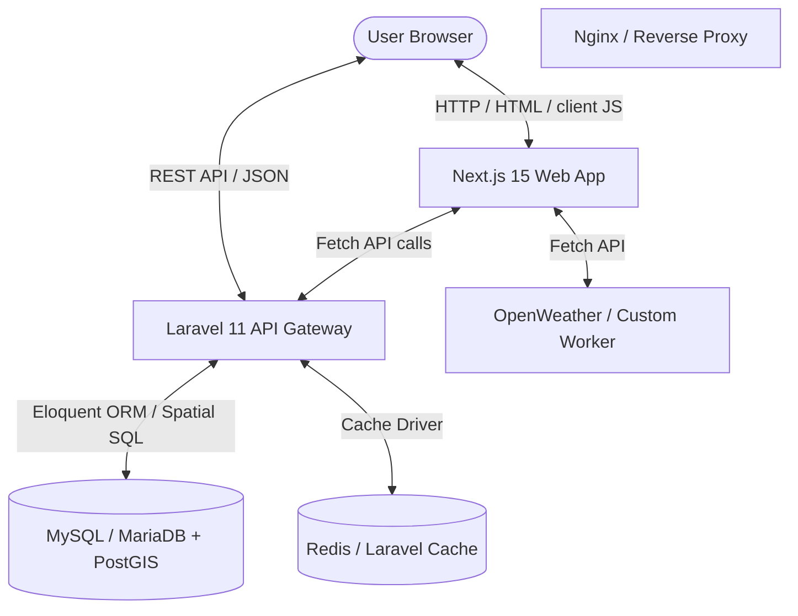

# Syrian Zone: High-Level System Map

This document serves as the high-level navigation map for the **Syrian Zone** codebase. It outlines the technology stack, repository layout, system-wide data flows, and the registration of core modules that power the platform.

---

## 1. System Architecture Overview

The Syrian Zone project is designed as a decoupled, multi-tier application consisting of a modern frontend web interface, a robust backend API, and a spatial-enabled relational database.



### Technology Stack
*   **Frontend**: Next.js 15 (App Router), React 19, TypeScript, Tailwind CSS, Lucide icons, Shadcn UI components.
*   **State Management**: Zustand (lightweight client-side stores), React Query / TanStack Query v5 (server state syncing).
*   **Mapping Engine**: MapLibre GL JS (offline-friendly, local style vector tiles).
*   **Backend**: Laravel 11 (PHP 8.2+), Eloquent ORM.
*   **Database**: MySQL or MariaDB with PostGIS (Spatial Extensions) enabled.
*   **Search**: Laravel Scout (with database/database-scout driver for lightweight matches).
*   **Caching**: Cache facade (file-based in development, Redis or Memcached capable in production).
*   **Process Manager**: PM2 (`ecosystem.config.js` for process monitoring).

---

## 2. Directory Tree Map

The repository is divided into two primary workspaces: `frontend` and `backend`. Below is a comprehensive folder layout mapping out the major systems.

```
syrianzone/
├── backend/                         # Laravel 11 API & Admin Portal
│   ├── app/
│   │   ├── Console/                 # Scheduled cron jobs & Artisan commands
│   │   ├── Http/
│   │   │   ├── Controllers/         # API Endpoint controllers (Polls, Sites, Metrics)
│   │   │   │   ├── Api/
│   │   │   │   │   └── V1/          # Versioned APIs (Transit Controller)
│   │   │   │   └── Auth/            # Authentication controllers
│   │   │   └── Middleware/          # Auth, CORS, and custom guards (TransitAdminAuth)
│   │   ├── Models/                  # Eloquent database models & casting definitions
│   │   └── Services/                # Isolated business logic services
│   ├── bootstrap/                   # Laravel bootstrap & middleware registration
│   ├── config/                      # Config files (database, cache, cors, scout, auth)
│   ├── database/
│   │   ├── migrations/              # Database schema migrations & spatial index scripts
│   │   └── seeders/                 # Database seeders for test data
│   ├── public/                      # Static assets & index entry point
│   ├── resources/                   # Blade templates & frontend resources
│   ├── routes/                      # Route definitions (api.php, web.php, console.php)
│   └── tests/                       # PHPUnit feature & unit tests
│
├── frontend/                        # Next.js 15 App Router Frontend
│   ├── public/                      # Static assets (logos, flag SVGs, local map tiles)
│   │   └── styles/                  # Map styles & vector schemas (dark-matter.json)
│   ├── src/
│   │   ├── app/                     # Next.js App Router folders (pages & layouts)
│   │   │   ├── _components/         # Global shared layouts (headers, buttons)
│   │   │   ├── admin/               # Global website administration
│   │   │   ├── compass/             # Political Compass module
│   │   │   ├── govapps/             # Government Apps directory
│   │   │   ├── house/               # Legislative Council (Majles) module
│   │   │   ├── party/               # Political Parties directory
│   │   │   ├── polls/               # Public opinion polling & voting page
│   │   │   ├── population/          # Population & environmental Atlas
│   │   │   ├── syofficial/          # Official Syrian Accounts list
│   │   │   ├── syid/                # Brandkit & visual identity resource downloads
│   │   │   ├── tierlist/            # Minister ranking/evaluation section
│   │   │   ├── transit/             # Syrian Transit mapping module (Sefrees Lines)
│   │   │   ├── globals.css          # Core CSS variables, typography, and styling
│   │   │   ├── layout.tsx           # Main root HTML layout & provider wrapper
│   │   │   └── page.tsx             # Homepage Server Component (reads markdown docs)
│   │   ├── components/              # Shadcn component declarations (UI kit)
│   │   ├── context/                 # React Context configurations (Theme, Language)
│   │   ├── data/                    # Local JSON files & static markdown files (about.md)
│   │   ├── lib/                     # Setup configurations (API client, helper utilities)
│   │   └── middleware.ts            # Frontend route redirects & auth state checks
│   ├── components.json              # Shadcn configuration configuration
│   ├── next.config.ts               # Next.js optimization parameters
│   └── tsconfig.json                # TypeScript compilation parameters
│
├── docs/                            # SYSTEM ARCHITECTURE MAPS (This directory)
├── deploy.sh                        # Shell script for server deployments
└── ecosystem.config.js              # PM2 cluster configuration
```

---

## 3. High-Level System Integration & Data Flows

### A. Dynamic Client-Server Rendering Flow (Example: Transit City Map)
1.  **Request**: User navigates to `/transit/city/damascus`.
2.  **Next.js SSR/ISR**: Next.js generates static routes in production using `generateStaticParams()` matching entries in local `cities.json` metadata.
3.  **Client Hydration**: The page loads with structural HTML and shell styling.
4.  **Fetch Trigger**: TanStack Query (`useMapData`) triggers a client-side API request to the backend:
    `GET http://localhost:8000/v1/cities/damascus/map-data`
5.  **Cache Check**: The Laravel backend checks the local Cache (`transit:map-data:damascus`).
    *   *If Cache Hit*: Returns JSON immediately in `<50ms`.
    *   *If Cache Miss*: Queries `route_geometries`, `routes`, `stops`, and `route_stop` from MySQL, formats them into a GeoJSON FeatureCollection, writes to cache (TTL: 600s), and returns.
6.  **Map Initialization**: MapLibre GL loads `/styles/styles/dark-matter.json` locally and renders the base canvas.
7.  **Layer Binding**: The cached GeoJSON routes and stops are fed into the map sources to paint vector paths and marker points.

### B. Political Compass / Polling Flow
1.  **Poll Fetching**: Frontend queries `/polls` or `/polls/{id}` to load current opinion surveys.
2.  **Voting Request**: Users cast votes via `POST /polls/{poll}/vote` or submit compass profiles.
3.  **API Throttling**: Laravel throttles voting requests using a specific middleware rate limiter (`throttle:voting`) to block bot manipulation.
4.  **Database Storage**: Vote records are stored in the `votes` table, and public ranking metrics are computed asynchronously or dynamically.

---

## 4. Platform Modules Map

The Syrian Zone portal is a multiplex of independent sub-modules that share a unified theme, visual layout, and language context.

| Module | Route Path | Frontend Strategy | Primary Backend API | Purpose |
| :--- | :--- | :--- | :--- | :--- |
| **Home Page** | `/` | ISR (Static) | Local markdown rendering | Portal directory, weather, and clock widgets |
| **Transit** | `/transit` | CSR (MapLibre client render) | `/v1/cities`, `/map-data`, `/search` | Interactive microbus (Service) routes, stops, and search maps |
| **Official Accounts** | `/syofficial` | SSG (Static Site Gen) | `/sites` | Catalog of verified Syrian public and news channels |
| **Brand kit** | `/syid` | SSG (Static) | Static assets | Free downloads of SVGs, colors, and layout files |
| **Tier List** | `/tierlist` | SSR (Server Rendered) | `/polls`, `/polls/{id}/leaderboard` | Public opinion ranking of government officials and ministers |
| **Atlas** | `/population` | CSR (Dynamic maps) | `/population/master`, `/env-report` | Environmental, historical, and demographic maps |
| **Political Compass**| `/compass` | CSR | `/submit` | Questionnaire calculating political position graphs |
| **Legislative House** | `/house` | SSG / CSR | Database-backed API | Visual directory of parliament and local council structure |
| **Official Apps** | `/govapps` | SSG | Static file records | Curated collection of useful mobile applications |

---

## 5. Build and Deployment Processes

Deployments are coordinated from the root directory using standard server configurations:

*   **Server Process (`ecosystem.config.js`)**: Defines application configuration for both frontend (Next.js server) and backend (PHP/Laravel API server) to enable high availability.
*   **Deployment Script (`deploy.sh`)**:
    1.  Pulls the latest code from GitHub.
    2.  Installs composer dependencies, runs migrations, and clears caches in `backend/`.
    3.  Runs `npm install` and `npm run build` in `frontend/` to generate optimized Next.js packages.
    4.  Restarts PM2 instances to switch to the compiled production bundle with zero downtime.
