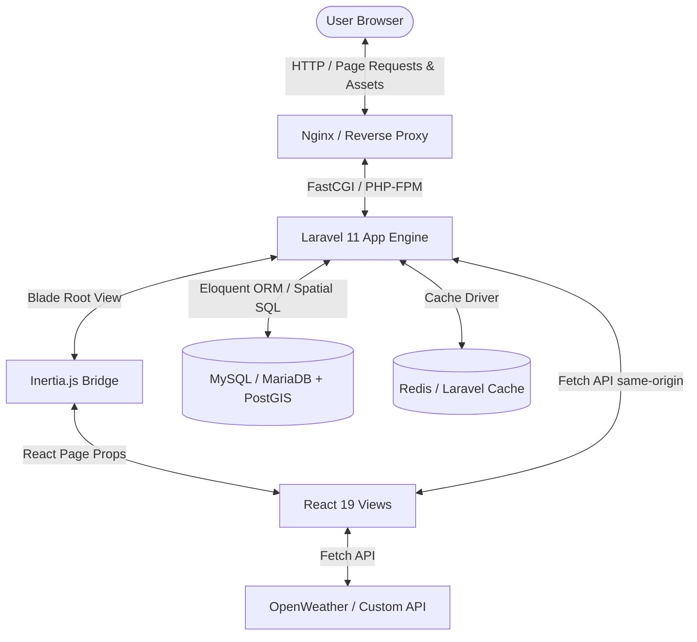

# Syrian Zone: High-Level System Map

This document serves as the high-level navigation map for the consolidated **Syrian Zone** codebase. It outlines the unified technology stack, repository layout, system-wide data flows, and core modules of the consolidated monolith.

---

## 1. System Architecture Overview

The Syrian Zone project operates as a unified, same-origin **Laravel + Inertia.js + React (TypeScript)** monolithic application. This structure eliminates cross-origin routing issues, simplifies data loading, and uses secure, cookie-based session authentication.



### Technology Stack
*   **Monolithic Engine**: Laravel 11 (PHP 8.2+), Eloquent ORM.
*   **Frontend Bridge**: Inertia.js (React Adapter) linking Laravel controllers to React views seamlessly.
*   **View Layer**: React 19, TypeScript, Tailwind CSS, Lucide icons, Shadcn UI components.
*   **Asset Bundler**: Vite (integrated via `laravel-vite-plugin`) compiling frontend assets directly into the `public/build` directory.
*   **State Management**: Zustand (lightweight client-side stores for map and studio state).
*   **Mapping Engine**: MapLibre GL JS (offline-friendly, local style vector tiles) and Leaflet for geographic rendering.
*   **Database**: MySQL or MariaDB with PostGIS (Spatial Extensions) enabled.
*   **Search**: Laravel Scout (with database/database-scout driver for lightweight matches).
*   **Caching**: Cache facade (file-based in development, Redis or Memcached capable in production).
*   **Process Manager**: PM2 (optional, e.g., if running Inertia SSR or local auxiliary servers).

---

## 2. Directory Tree Map

Following the consolidation, all code and assets reside in a single root repository. The old `/backend` and `/frontend` workspaces have been retired.

```
syrianzone/                          # Root Directory
├── app/                             # Laravel Application Core
│   ├── Console/                 # Scheduled cron jobs & Artisan commands
│   ├── Http/
│   │   ├── Controllers/         # Controllers serving Inertia pages & API endpoints
│   │   │   ├── Auth/            # Stateful session-based auth controllers
│   │   │   └── ExternalDataController.php  # Handles external CSV files and asset metadata
│   │   └── Middleware/          # Stateful session, CSRF, and role checks
│   ├── Models/                  # Eloquent database models & spatial definitions
│   └── Services/                # Isolated business logic services
├── bootstrap/                       # Laravel bootstrap & middleware registration
├── config/                          # Laravel Configuration (database, cache, inertia, etc.)
├── database/
│   ├── migrations/              # Database schema migrations & spatial index scripts
│   └── seeders/                 # Database seeders for test data
├── docs/                            # SYSTEM ARCHITECTURE & INTEGRATION MAPS (This directory)
├── public/                          # Static assets & web entrypoint
│   ├── assets/                      # Brand images, flags, download items
│   ├── build/                       # Vite compiled production assets (React+TSX bundle)
│   └── styles/                      # Map styles (dark-matter.json) & vector grids
├── resources/                       # Frontend Source & Templates
│   ├── css/
│   │   └── app.css                  # Merged Tailwind & global CSS
│   ├── js/
│   │   ├── app.tsx                  # Inertia React entrypoint & bootstrapping
│   │   ├── Components/              # UI Components (Shadcn and custom inputs)
│   │   ├── Contexts/                # Global Theme/Language providers
│   │   ├── Layouts/                 # Persistent Layout wrappers (Navbar, Sidebar)
│   │   ├── Lib/                     # Client utils (API client, coordinate helpers)
│   │   ├── Pages/                   # React Page Components served by Inertia
│   │   └── Types/                   # Shared TypeScript declarations
│   └── views/
│       └── app.blade.php            # Primary Blade container for Inertia
├── routes/                          # Unified route definitions
│   ├── web.php                      # Handles ALL page routes (Inertia) & session authentication
│   └── api.php                      # Handles dynamic spatial, search, and map-data endpoints
├── .github/workflows/deploy.yml     # CI: depot image build + ssh deploy on push to main
├── .github/workflows/deploy.yml     # CI/CD deployment workflow for self-hosted GitHub runners
├── tailwind.config.js               # Unified Tailwind styling rules
├── tsconfig.json                    # Consolidated TypeScript rules
└── vite.config.js                   # Vite configuration with Laravel & React plugins
```

---

## 3. High-Level System Integration & Data Flows

### A. Inertia Page Loading Flow
1.  **Request**: User navigates to `/transit`.
2.  **Controller Execution**: The `TransitController@index` action is triggered on the server.
3.  **Data Hydration**: Laravel fetches the list of active cities and maps from the database.
4.  **Inertia Bridge**: The controller calls `Inertia::render('Transit/Index', ['cities' => $cities])`.
5.  **Page Serve**:
    *   *First Load*: Laravel serves the initial Blade root view (`app.blade.php`) containing the React shell and hydrated state data inside a `data-page` attribute.
    *   *Subsequent Clicks*: Inertia intercepts the click, fetches the page data via an AJAX request, and updates the React components in-place without a full browser reload.

### B. Dynamic Spatial & Map Queries
1.  **Map Canvas**: The client renders a MapLibre GL map instance inside a dynamic React component.
2.  **Background Queries**: To fetch complex geometries (e.g., active bus route coordinates or GPS stops), the React component makes dynamic, same-origin AJAX calls to the API routes:
    `GET /api/v1/cities/{id}/map-data`
3.  **JSON Response**: The Laravel API processes the spatial query (leveraging PostGIS/MySQL spatial indexes), caches the output to minimize database stress, and returns standard GeoJSON to the client.
4.  **Map Painting**: The client-side map parses the GeoJSON and updates the active overlays dynamically without reloading the UI.

---

## 4. Platform Modules Map

All modules share the unified web layout (`MainLayout`), application contexts, and Vite asset compilation pipeline.

| Module | Web Path | Controller & Logic | Primary React View |
| :--- | :--- | :--- | :--- |
| **Home Page** | `/` | `HomeController` (Reads weather & home content) | `Pages/Home` |
| **Official Accounts** | `/syofficial` | `ExternalDataController@syofficial` | `Pages/Sites/Index` |
| **SyId Brand kit** | `/syid` | `ExternalDataController@syid` (Checks icon presence) | `Pages/SyId/Index` |
| **Government Apps** | `/govapps` | `ExternalDataController@govapps` | `Pages/GovApps/Index` |
| **Syrian Contributors** | `/syrian-contributors` | `ExternalDataController@contributors` | `Pages/SyrianContributors/Index` |
| **Sites Directory** | `/sites` | `ExternalDataController@sites` | `Pages/Sites/Index` |
| **Political Parties** | `/party` | `ExternalDataController@party` | `Pages/Party/Index` |
| **Majles (Parliament)** | `/house` | `ExternalDataController@house` | `Pages/House/Index` |
| **Political Alignment** | `/alignment` | `ExternalDataController@alignment` | `Pages/Alignment/Index` |
| **Transit Mapping** | `/transit` | `TransitController` (Loads cities & route metrics) | `Pages/Transit/Index` |
| **Opinion Polling** | `/polls` | `PollController` (Manages active surveys) | `Pages/Polls/Index` |
| **Compass Quiz** | `/compass` | `CompassController` (Processes quiz options) | `Pages/Compass/Index` |
| **Minister Rankings** | `/tierlist` | `TierListController` | `Pages/TierList/Index` |

---

## 5. Build and Deployment Processes

Deployments are automated through a self-hosted GitHub runner connected to the repository.

*   **Production deployment script (`deploy.sh`)**: Orchestrates Vite production compiling, file synchronizations to active directories, composer updates, and database migrations.
*   **CI/CD Pipeline (`.github/workflows/deploy.yml`)**: Automates execution of the deploy script on merges to `main`.
